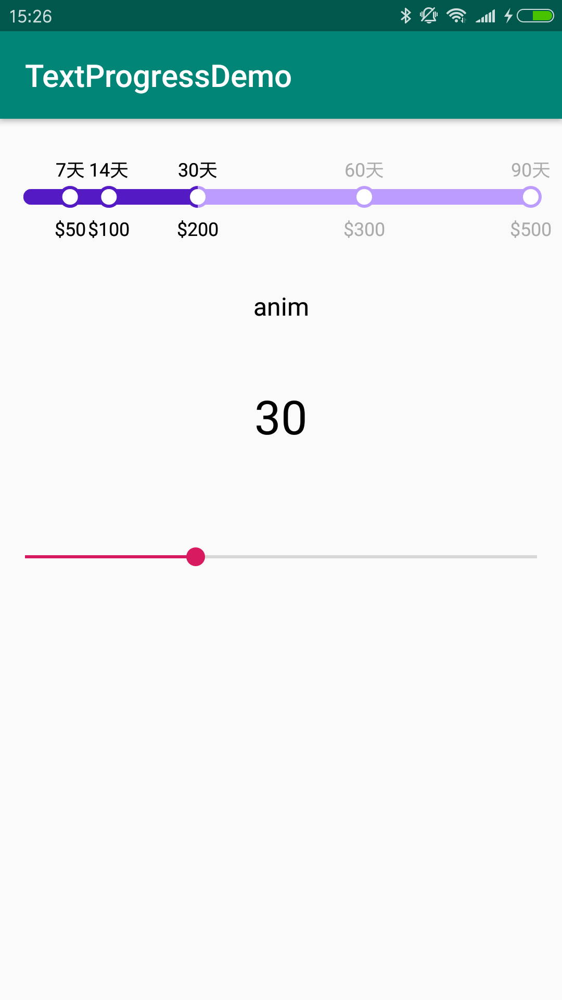
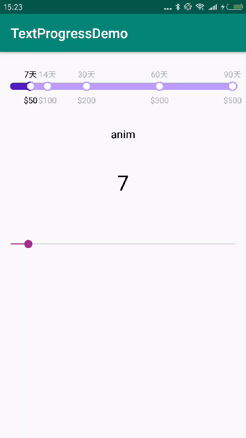

# TextProgressView
横向的带文字的progressview

####使用：直接复制TextProgressView.java到项目中

效果：

第一步：

简单使用
	
	<com.lyz.textprogressdemo.TextProgressView
        android:id="@+id/tpv"
        android:layout_width="match_parent"
        android:layout_height="100dp" />
        
或者自定义属性

	<com.lyz.textprogressdemo.TextProgressView
        android:id="@+id/tpv"
        android:layout_width="match_parent"
        android:layout_height="100dp"
        app:tpvBgStrokeWidth="10dp"
        app:tpvBigRadius="7dp"
        app:tpvSmallRadius="5dp"
        app:tpvColorBg="#bd9cff"
        app:tpvColorBgText="#aaa"
        app:tpvColorProgress="#541bc5"
        app:tpvColorProgressText="#000"
        app:tpvContentMargin="20dp"
        app:tpvDuration="1000"
        app:tpvTextSize="12sp" />

第二步：        
在Activity中

	final TextProgressView tpv = findViewById(R.id.tpv);
    //初始化
    tpv.setCurrentSize(7);
    tpv.setMaxSize(90);
    tpv.init(new float[]{7, 14, 30, 60, 90},
             new String[]{"7天", "14天", "30天", "60天", "90天"},
             new String[]{"$50", "$100", "$200", "$300", "$500"});
             
